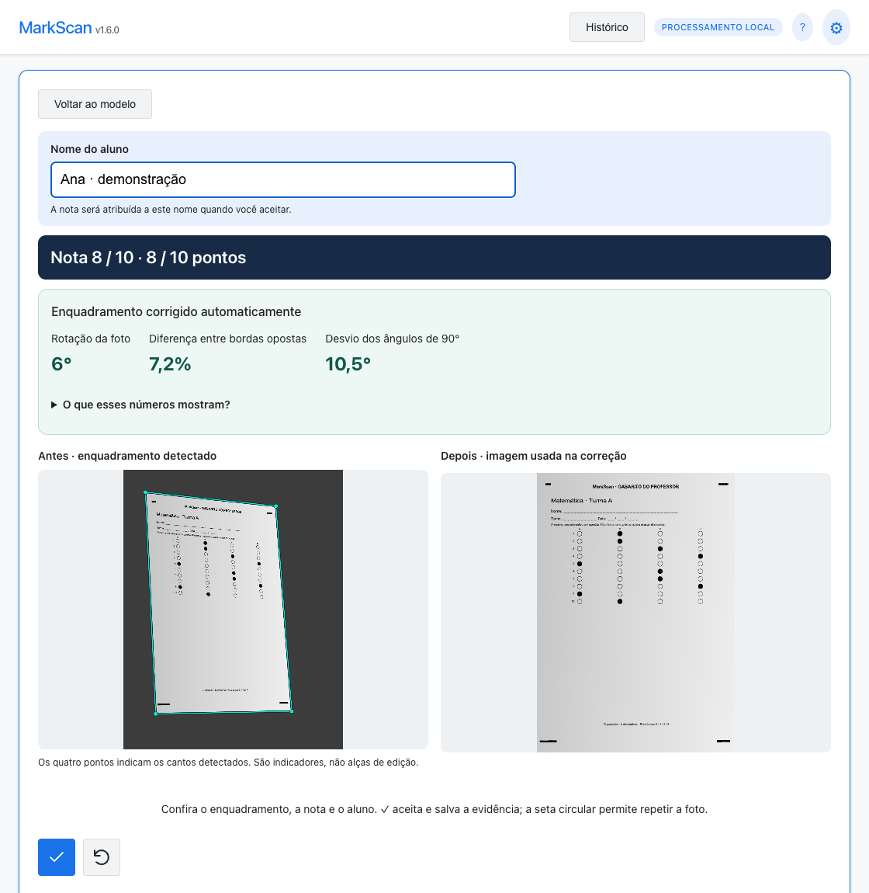
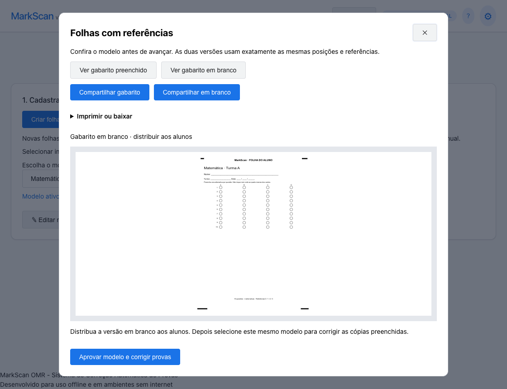
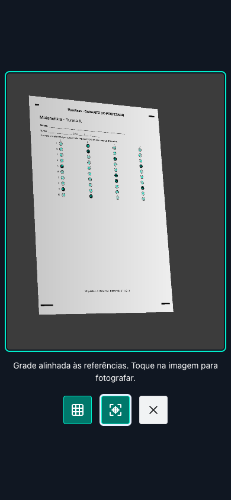
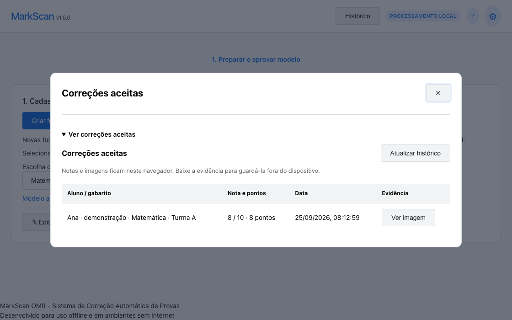

# MarkScan

**Crie gabaritos, corrija provas e guarde a evidência — diretamente no navegador.**

[**Abrir aplicativo**](https://tonmarcondes.github.io/MarkScan/) · [Manual de uso](docs/GUIA.md) · [Reportar problema](https://github.com/tonmarcondes/MarkScan/issues)

Versão **1.6.0** · JavaScript, HTML e CSS · Processamento local · GitHub Pages



*Captura real do aplicativo com dados fictícios e câmera simulada. A nota só é registrada após a aprovação do professor.*

## O que o MarkScan faz

| Recurso | Como funciona |
| --- | --- |
| Modelos de correção | Criação de folhas com 1–100 questões, 2–8 alternativas e áreas circulares, quadradas ou retangulares. |
| Importação | Imagens e PDFs com escolha da página, recorte e mapeamento das respostas. |
| Enquadramento automático | Quatro referências impressas permitem corrigir posição, rotação e perspectiva de uma folha plana. |
| Conferência visual | Foto original com os cantos detectados, imagem corrigida, medidas geométricas, nota e pontos. |
| Identificação do aluno | Nome digitado, seleção de uma lista ou correção sem identificação. |
| Evidências | Salvamento conjunto de nota, aluno, respostas e imagem; consulta e download pelo histórico. |
| Distribuição | Versões preenchida e em branco, compartilhamento, download PNG e impressão. |
| Uso offline | Arquivos do aplicativo e leitor PDF disponíveis após o primeiro carregamento completo. |

## Comece em quatro passos

1. **Prepare o modelo.** Configure a grade pela engrenagem. Crie uma folha ou importe uma imagem/PDF; confira o mapeamento e as referências.
2. **Distribua e aprove.** Imprima ou compartilhe a versão em branco para os alunos. Selecione o modelo correspondente e aprove a prévia.
3. **Fotografe e confira.** Inclua os quatro blocos e toque na imagem da câmera. O app alinha a foto, calcula a nota e mostra o antes e depois.
4. **Aceite e salve.** Confira o aluno e use ✓. Siga para a próxima prova ou finalize. Consulte notas e baixe as evidências em **Histórico**.

O botão **?** abre o manual ilustrado dentro do aplicativo, com a função de cada ícone. Para instruções de calibração, PDF, impressão e resolução de problemas, consulte o [manual completo](docs/GUIA.md).

## Veja o fluxo

| Modelo pronto para distribuir | Câmera com grade opcional |
| --- | --- |
|  |  |



O histórico contém **correções aceitas**, com aluno, nota, pontos, data e evidência. Não inclui prévias descartadas nem registra todos os cliques do aplicativo.

## Entenda o enquadramento

Após a captura, o MarkScan detecta as quatro referências e transforma a fotografia para as dimensões do modelo. A tela apresenta:

- **Antes:** foto original com o contorno e os quatro cantos detectados. Os pontos são indicadores visuais, não alças de edição.
- **Depois:** imagem alinhada efetivamente usada no cálculo da nota, sem números ou contornos sobre as respostas.
- **Rotação:** orientação da folha na fotografia, em graus.
- **Desvio dos ângulos:** maior afastamento dos quatro cantos em relação a um ângulo reto (90°).
- **Diferença entre bordas opostas:** maior diferença relativa entre os comprimentos superior/inferior e esquerda/direita. A fórmula é `100 × |a − b| / max(a, b)`.

Essas medidas descrevem a geometria da fotografia; **não são uma porcentagem de confiança da nota** nem medem toda forma de distorção. Se o enquadramento estiver incorreto, repita a fotografia antes de aceitar. Sem quatro referências válidas, o app bloqueia o aceite de modelos que exigem alinhamento.

## Ícones de câmera e conferência

| Ícone | Ação | Quando usar |
| :---: | --- | --- |
|  | Grade | Mostrar ou ocultar os contornos das respostas. |
|  | Alinhamento automático | Ativar ou pausar o acompanhamento das referências na câmera. |
|  | Fechar | Encerrar a câmera ou fechar uma janela. |
|  | Aceitar e salvar | Registrar a correção após conferir foto, nota e aluno. |
|  | Repetir | Tirar outra foto ou escolher outro arquivo antes de aceitar. |
|  | Próxima prova | Preparar outra correção depois de salvar. |
|  | Finalizar | Fechar a câmera e voltar aos modelos, preservando a evidência. |
|  | Baixar evidência | Exportar o JPEG pela janela da evidência no histórico. |

A engrenagem **⚙** reúne as configurações; **?** abre a ajuda. Os controles têm nomes acessíveis e dicas ao passar o cursor.

## Executar localmente

Não há etapa de compilação nem servidor de processamento.

```sh
git clone https://github.com/tonmarcondes/MarkScan.git
cd MarkScan
python3 -m http.server 8080
```

Abra [localhost:8080](http://localhost:8080). Módulos JavaScript exigem HTTP; abrir `index.html` diretamente não funciona. Para acessar a câmera fora de localhost, use HTTPS e conceda a permissão solicitada pelo navegador.

### Publicação

O site usa **GitHub Pages**, branch `main`, pasta raiz, com caminhos relativos e `.nojekyll`. Ao publicar alterações nos arquivos, atualize a versão em `js/version.js` e o nome do cache em `sw.js`. Novos recursos necessários offline devem entrar na lista de arquivos do service worker.

## Arquitetura

Aplicação estática com módulos ES, sem framework de interface ou backend. `App` coordena os módulos, com separação entre interface, leitura e persistência.

```text
Interface e fluxo         Leitura e geometria          Dados e saída
UI / HelpGuide            Scanner / OMREngine          Template / Storage
Camera / ExamReview       Alignment / SolidReferences  Config / Roster
DocumentImport            AlignmentReview              SheetBuilder / Evidence
```

- A câmera fornece a fotografia; o alinhamento normaliza a folha; o OMR mede o preenchimento nas posições cadastradas.
- A conferência mantém a fotografia congelada. A nota e a evidência sempre usam o mesmo quadro aceito.
- Gabaritos e histórico usam IndexedDB, com alternativa em localStorage. Configurações usam localStorage.
- O service worker mantém os arquivos do aplicativo, a ajuda ilustrada e o leitor PDF em cache para uso offline.

## Dados e limites

As provas são processadas localmente, sem envio a um servidor de correção. O histórico pertence **ao navegador, dispositivo e endereço do site**: localhost e GitHub Pages não compartilham registros. Não há sincronização nem backup em nuvem. Limpar os dados do site remove os registros; exporte as evidências que precisar preservar.

O reconhecimento exige o modelo correto e respostas nas posições cadastradas. Os blocos indicam orientação, mas não identificam o conteúdo da prova. Eles devem estar presentes nas cópias físicas, com pelo menos 5 px de espessura na imagem gerada; 8 px é o padrão.

A transformação corrige perspectiva de papel plano, não curvatura, dobras ou distorção óptica forte. Desfoque, sombras e referências cortadas podem impedir a leitura. Modelos antigos sem referências exigem o mesmo enquadramento da calibração. Valide impressão e câmera com provas conhecidas antes de corrigir em lote.

## Desenvolvimento e testes

Instale as ferramentas de teste e mantenha o servidor local aberto:

```sh
npm install --no-save --package-lock=false playwright
npx playwright install chrome
node tests/browser.cjs
node tests/review.cjs
node tests/alignment.cjs
MARKSCAN_CODED=1 node tests/alignment.cjs
node tests/workflow.cjs
node tests/documents.cjs
node tests/guide.cjs
```

Use uma versão do Node compatível com o Playwright instalado. `MARKSCAN_URL` permite testar outra implantação. `MARKSCAN_DOC_SHOTS=1 node tests/guide.cjs` atualiza as capturas da documentação usando dados fictícios e câmera simulada.

A suíte cobre calibração, configurações, PDF/recorte, captura, perspectivas e rotações, rejeição de referências inválidas, conferência sem sobreposição, medidas geométricas, evidências, falhas de armazenamento, histórico, compartilhamento simulado e offline. Testes de câmera simulada não substituem validação no aparelho físico.

## Dependências incluídas

| Biblioteca | Uso | Origem e licença |
| --- | --- | --- |
| PDF.js 6.3.289 | Leitura local de PDFs | [Projeto oficial](https://mozilla.github.io/pdf.js/) · Apache-2.0 · `js/vendor/pdfjs/` |
| js-aruco, revisão `2203d4b` | Referências codificadas legadas e utilitários de contornos | [Repositório original](https://github.com/jcmellado/js-aruco) · avisos e licença em `js/vendor/` |

## Reportar problemas

Abra uma [issue](https://github.com/tonmarcondes/MarkScan/issues) com a versão exibida no app, navegador, dispositivo, passos para reproduzir e resultado esperado. Prefira imagens de demonstração, sem nomes ou dados reais de alunos.
